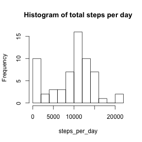
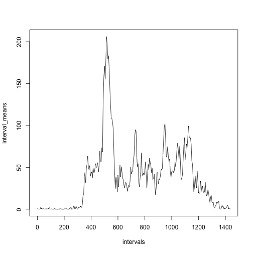
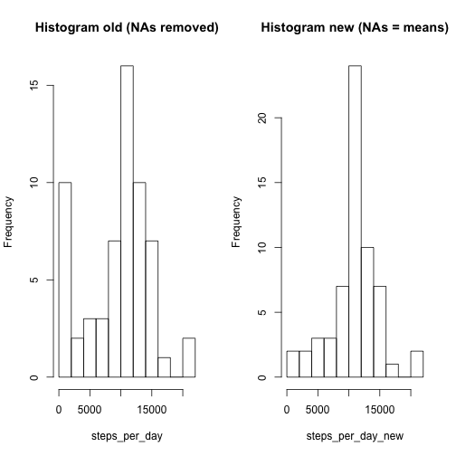

# Reproducible Research: Peer Assessment 1

## Loading and preprocessing the data


```r
activity <- read.csv("activity.csv") # read data into a data.frame
str(activity) # see structure of the data set
```

```
## 'data.frame':	17568 obs. of  3 variables:
##  $ steps   : int  NA NA NA NA NA NA NA NA NA NA ...
##  $ date    : Factor w/ 61 levels "2012-10-01","2012-10-02",..: 1 1 1 1 1 1 1 1 1 1 ...
##  $ interval: int  0 5 10 15 20 25 30 35 40 45 ...
```

We observe that we can use the days to split the data set according to the factor variable date


```r
activity_per_day <- split(activity$steps, activity$date) # split data into a list of vectors, each representing the activity per day
steps_per_day <- sapply(activity_per_day, sum, na.rm = TRUE) # calculate the total steps per day in a separate vector
```

## What is mean total number of steps taken per day?

First we plot a histogram to get an impression of the distribution of steps counts.


```r
hist(steps_per_day, breaks = 15, main = "Histogram of total steps per day")
```

 

The mean and median of total steps per day are


```r
mean(steps_per_day)
```

```
## [1] 9354
```

```r
median(steps_per_day)
```

```
## [1] 10395
```

## What is the average daily activity pattern?

First we have to calculate the mean for each interval. We therefore go back to the activity data.frame and subset the observations according to the interval


```r
activity_per_interval <- split(activity$steps, activity$interval)
interval_means <- sapply(activity_per_interval, mean, na.rm = TRUE)
```

We can then plot the time series where we use a linear scale that makes use of the fact that there are 1440 minutes in a day and we have 288 5-minute intervals in 1440. Using 0 as indicating the first interval we therefore compute the intervals as


```r
intervals <- seq(0, (287*5), by = 5)
plot(intervals, interval_means, type = "l")
```

 

To answer the second question we can look for the maximum mean of any interval


```r
head(sort(interval_means, decreasing = TRUE), 3)
```

```
##   835   840   850 
## 206.2 195.9 183.4
```

and find the corresponding interval to be 835.

## Imputing missing values

To calculate the number of missing values we use that we can ask if an entry is an NA value or not.


```r
na_number <- sum(is.na(activity$steps))
```

Therefore 2304 NA values are included in the dataset. It may make sense to replace the NA values by the mean value for the corresponding interval. The new data set will be stored in object *activity_new*


```r
activity_plus_one <- cbind(counter = (1:nrow(activity)), activity)
head(activity_plus_one)
```

```
##   counter steps       date interval
## 1       1    NA 2012-10-01        0
## 2       2    NA 2012-10-01        5
## 3       3    NA 2012-10-01       10
## 4       4    NA 2012-10-01       15
## 5       5    NA 2012-10-01       20
## 6       6    NA 2012-10-01       25
```

```r
NA_intervals <- activity_plus_one$interval[is.na(activity$steps)]
NA_rows <- activity_plus_one$counter[is.na(activity$steps)]

activity_new <- read.csv("activity.csv")
for(i in 1:na_number) {
     activity_new[NA_rows[i], 1] <- interval_means[[as.character(NA_intervals[i])]]
}
```

To get an impression of the new data set we plot a histogram, compare it to the one above and calculate mean and median.


```r
activity_per_day_new <- split(activity_new$steps, activity_new$date)
steps_per_day_new <- sapply(activity_per_day_new, sum, na.rm = TRUE)
par(mfrow = c(1, 2))
hist(steps_per_day, breaks = 15, main = "Histogram old (NAs removed)")
hist(steps_per_day_new, breaks = 15, main = "Histogram new (NAs = means)")
```

 

```r
mean(steps_per_day_new)
```

```
## [1] 10766
```

```r
median(steps_per_day_new)
```

```
## [1] 10766
```

It can be observed that both mean and median values have increased and that they are equal now. It appears as if the distribution is almost symmetric now.
